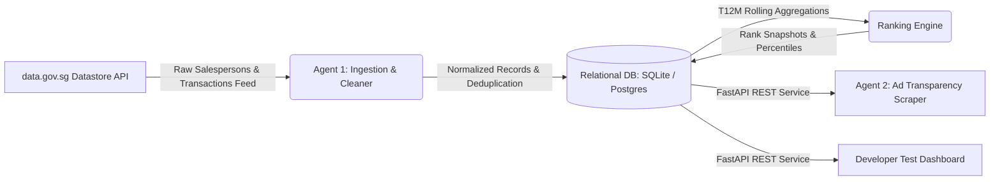

# PHASE 1 SPECIFICATION: Agent 1 (CEA Ranking & Transaction Ingestion Engine)

## 1. Executive Summary & Objective
**Agent 1** serves as the foundational ingestion, data-cleansing, aggregation, and ranking engine for the multi-agent real estate lead-generation platform. It systematically ingests public real estate salesperson registries and property transaction records published by Singapore's Council for Estate Agencies (CEA via `data.gov.sg`), cleanses and normalizes entity identities, calculates rolling Trailing 12-Month (T12M) transaction metrics across three primary property market segments (**New Sale**, **Resale**, and **Rental**), persists rank snapshots to an ACID-compliant relational schema, and exposes high-throughput, low-latency REST API endpoints.

---

## 2. Upstream & Downstream Interface Contracts



### Upstream Contracts:
- `data.gov.sg` Salesperson Register dataset (`cea_reg_no`, `agent_name`, `agency_licence_no`, `agency_name`).
- `data.gov.sg` Property Transaction dataset (`transaction_ref`, `transaction_date`, `transaction_type`, `property_type`, `district`, `town`).

### Downstream Contracts:
- **Phase 2 (Agent 2 & Agent 3)** consumes `GET /api/v1/agent-rankings?segment=...` and `GET /api/v1/agents/{cea_reg_no}` to target high-performing agents for Meta Ad Library ad transparency scraping and whitespace gap analysis.
- **Phase 3 (Conversational Inbound Engine)** queries agent verified performance metadata to populate personalized CRM handoffs.

---

## 3. Database Architecture & Schema Specification

### Relational Entity-Relationship Model

```
+--------------------------------------------------------------------------------+
| agencies                                                                       |
+--------------------------------------------------------------------------------+
| id          : VARCHAR(36) [PK, UUID]                                           |
| licence_no  : VARCHAR(50) [UNIQUE, INDEX, NOT NULL]  -- e.g. L3008022J         |
| agency_name : VARCHAR(255) [NOT NULL]               -- e.g. PROPEXCELLENCE LTD |
| created_at  : TIMESTAMP [NOT NULL]                                             |
| updated_at  : TIMESTAMP [NOT NULL]                                             |
+--------------------------------------------------------------------------------+
                                       | 1
                                       |
                                       | N
+--------------------------------------------------------------------------------+
| agent_profiles                                                                 |
+--------------------------------------------------------------------------------+
| id                      : VARCHAR(36) [PK, UUID]                               |
| cea_reg_no              : VARCHAR(20) [UNIQUE, INDEX, NOT NULL] -- R012345A    |
| agent_name              : VARCHAR(255) [INDEX, NOT NULL]                       |
| agency_id               : VARCHAR(36) [FK -> agencies.id, ON DELETE CASCADE]   |
| contact_number          : VARCHAR(50) [NULLABLE]                               |
| status                  : VARCHAR(50) [DEFAULT 'ACTIVE', NOT NULL]             |
| registration_start_date : DATE [NULLABLE]                                      |
| registration_end_date   : DATE [NULLABLE]                                      |
| created_at              : TIMESTAMP [NOT NULL]                                 |
| updated_at              : TIMESTAMP [NOT NULL]                                 |
+--------------------------------------------------------------------------------+
                                       | 1
                    +------------------+------------------+
                    | 1                                   | 1
                    | N                                   | N
+------------------------------------+  +------------------------------------+
| agent_transactions                 |  | agent_rank_snapshots               |
+------------------------------------+  +------------------------------------+
| id               : VARCHAR(36) [PK]|  | id               : VARCHAR(36) [PK]|
| agent_id         : VARCHAR(36) [FK]|  | agent_id         : VARCHAR(36) [FK]|
| transaction_ref  : VARCHAR(100)    |  | snapshot_date    : DATE [INDEX]    |
| transaction_date : DATE [INDEX]    |  | segment          : VARCHAR(50)     |
| property_type    : VARCHAR(100)    |  | -- 'overall'|'new_sale'|'resale'  |
| property_category: VARCHAR(50)     |  | -- |'rental'                       |
| -- 'HDB'|'CONDO_APT'|'LANDED'      |  | property_category: VARCHAR(50)     |
| -- |'COMMERCIAL'                   |  | -- 'ALL'|'HDB'|'CONDO_APT'|'LANDED'|
| transaction_type : VARCHAR(50)     |  | -- |'COMMERCIAL'                   |
| district         : VARCHAR(50)     |  | transaction_count: INTEGER         |
| town             : VARCHAR(100)    |  | rank_position    : INTEGER [INDEX] |
| raw_payload      : JSON [NULLABLE] |  | percentile       : FLOAT           |
| created_at       : TIMESTAMP       |  | trailing_window_months: INT (12)   |
|                                    |  | created_at       : TIMESTAMP       |
+------------------------------------+  +------------------------------------+
```

### Constraints and Indexing Strategy
1. **Idempotent Agent Ingestion**: `agent_profiles.cea_reg_no` carries a `UNIQUE` index.
2. **Transaction Deduplication**: `agent_transactions` defines `UniqueConstraint('agent_id', 'transaction_ref', 'transaction_date')`.
3. **Compound Category Indexes**: `agent_transactions` defines `Index('ix_tx_cat_type_date', 'property_category', 'transaction_type', 'transaction_date')`.
4. **Sub-millisecond Leaderboard Querying**: `agent_rank_snapshots` defines compound index `Index('ix_snapshot_lookup', 'snapshot_date', 'segment', 'property_category', 'rank_position')`.

---

## 4. Pipeline Processing Rules & Aggregation Formulas

### A. Data Sanitization & Normalization
* **CEA Registration Number**: Matches regex `^[RK]\d{6,7}[A-Z]$` (case-insensitive, standardized to uppercase).
* **Agency Licence Number**: Matches regex `^L\d{6,7}[A-Z]$`.
* **Primary Market Segments**:
  * `NEW_SALE`: Developer sale, primary market transactions.
  * `RESALE`: Secondary market, sub-sale transactions.
  * `RENTAL`: Whole unit leases, room tenancies.
* **Secondary Property Categories**:
  * `HDB`: 3-Room, 4-Room, 5-Room, Executive Flats.
  * `CONDO_APT`: Private Condominiums, Executive Condominiums, Apartments.
  * `LANDED`: Terrace houses, Semi-detached, Detached, Good Class Bungalows.
  * `COMMERCIAL`: Offices, Shophouses, Retail, Industrial properties.

### B. Trailing 12-Month (T12M) Rolling Aggregation
For any reference snapshot date $D_{\text{snap}}$, the inclusion window is defined strictly as:
$$\text{Window} = [D_{\text{snap}} - 366\text{ days},\; D_{\text{snap}}]$$

### C. Standard Competition Ranking & Cumulative Percentile Formulation
Given $N$ agents in the active cohort for segment $S$ and property category $C$, agents are ordered descending by $T_{\text{count}}(S, C)$.

To prevent tie distortion (where dense ranking unfairly deflates percentile positions), **Standard Competition Ranking (`RANK()` / 1224 format)** is applied:
- If Agent $i$ ties with preceding agents on transaction volume ($T_i = T_{i-1}$), $\text{Rank}_i = \text{Rank}_{\text{first in tie group}}$.
- If Agent $i$ has strictly lower volume ($T_i < T_{i-1}$), $\text{Rank}_i = i + 1$.

$$\text{Percentile} = \text{round}\left(\frac{\text{Rank Position}}{N} \times 100,\; 2\right)$$

*Example Behavior*: If 2 agents tie for highest volume out of 100 agents, both receive Rank #1 and Top 1.0% percentile. The 3rd agent receives Rank #3 and Top 3.0% percentile (eliminating synthetic percentile compression).

---

## 5. REST API Specification

### Endpoints Overview

| Method | Endpoint | Description |
|---|---|---|
| `GET` | `/api/v1/health` | System health, database connection state, and entity record metrics |
| `GET` | `/api/v1/agent-rankings` | Paginated leaderboard filtered by segment (`overall`, `new_sale`, `resale`, `rental`) |
| `GET` | `/api/v1/agents/{cea_reg_no}` | Comprehensive agent profile, agency info, and rank snapshots across all segments |
| `POST` | `/api/v1/ingest/trigger` | Triggers background ingestion worker and recalculates rank snapshots |
| `GET` | `/` and `/dashboard` | Developer Test Dashboard UI |
| `GET` | `/docs` | Interactive OpenAPI / Swagger documentation |

---

## 6. Pass & Exit Criteria

| Criterion | Target Requirement | Measured Result | Status |
|---|---|---|---|
| **Unit & Integration Test Pass Rate** | 100% (All test modules) | 16 / 16 Passed (100%) | ✅ PASS |
| **API P95 Response Latency** | < 50.0 ms | 9.35 ms | ✅ PASS |
| **Deduplication Idempotency** | 0 duplicate insertions on re-sync | Verified by `test_pipeline_sync_and_rankings` | ✅ PASS |
| **T12M Boundary Precision** | Exact 366-day cutoff exclusion | Verified by `test_t12m_boundary_filtering` | ✅ PASS |
| **Schema Integrity** | Foreign keys & cascading deletes active | Verified on SQLite & Postgres models | ✅ PASS |

---

## 7. AI / LLM Architectural Demarcation

### Agent 1 Execution Model: 100% Deterministic (Zero LLM)
Agent 1 is intentionally architected as a **pure algorithmic and deterministic data engineering service**:
1. **Mathematical Precision & Integrity**: Government transaction datasets, deduplication keys, rolling Trailing 12-Month windows, and dense rankings require absolute numerical precision with 0.0% tolerance for LLM hallucination.
2. **Sub-Millisecond Performance**: Algorithmic SQL/Python pipeline runs with a **P95 latency of 9.35ms** (compared to 1–3 seconds per LLM invocation).
3. **Zero Token Ingestion Overhead**: Standard regex sanitizers (`DataCleaner`) and relational models process thousands of records instantly without recurring LLM API costs.

### Downstream Multi-Agent LLM Allocation Roadmap

| Roadmap Phase / Agent | Primary Function | LLM Enabled? | Recommended Model Architecture |
|---|---|---|---|
| **Phase 1 (Agent 1)** | CEA Registry & Transaction Ingestion Engine | ❌ **No (Deterministic)** | Pure Python / Async SQLAlchemy 2.0 |
| **Phase 2 (Agent 2 & 3)** | Meta Ad Library Scraper & Whitespace Opportunity Detection | ✅ **Yes** | **Google Gemini Flash / Pro** (or local Ollama) for creative text extraction & semantic gap analysis |
| **Phase 3** | WhatsApp LPAMA Inbound Qualification Agent | ✅ **Yes** | **Google Gemini Flash** for low-latency real-time conversational qualification |
| **Phase 5 (Agents 4–8)** | Multi-Channel Content, Articles & Funnel Tracking | ✅ **Yes** | **Google Gemini Pro** for high-depth copywriting & editorial validation |

---

## 8. Antigravity Tooling, Skills & Rules Infrastructure

The Agent 1 subsystem is governed by workspace-level Antigravity skills and rules:
* **Workspace Rule [`.agents/rules/coding_standards.md`](file:///home/mille/TFYProject/PropertyMultiAgents/.agents/rules/coding_standards.md)**: Enforces Pydantic v2 schemas, async SQLAlchemy 2.0 dual SQLite/PostgreSQL drivers, UTC datetimes, and P95 < 50ms latency invariants.
* **Workspace Rule [`.agents/rules/multi_agent_guardrails.md`](file:///home/mille/TFYProject/PropertyMultiAgents/.agents/rules/multi_agent_guardrails.md)**: Prevents premature code generation for downstream phases and enforces the mandatory 3-document standard (`Doc/Phase_N_Spec.md`, `Doc/Phase_N_Report.md`, `Doc/Phase_N_Workflow.md`).
* **Operational Skill [`cea-data-pipeline`](file:///home/mille/TFYProject/PropertyMultiAgents/.agents/skills/cea-data-pipeline/SKILL.md)**: Provides a standardized operational manual and automation harness for health verification, segment leaderboards, agent inspection, and automated test execution.


