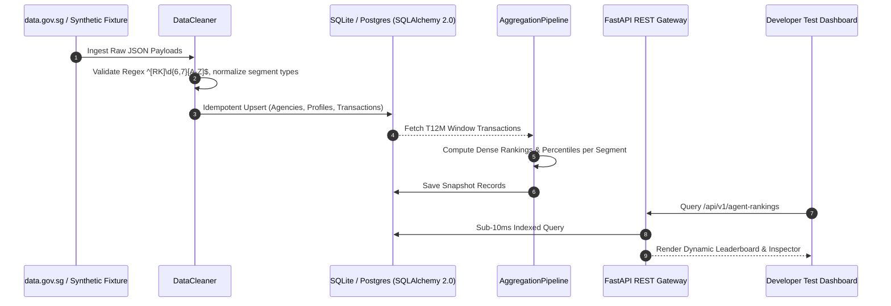

# PHASE 1 WORKFLOW & ENGINEERING RETROSPECTIVE

## 1. Development Process & Methodologies

The construction of **Phase 1: Agent 1 (CEA Ranking & Transaction Ingestion Engine)** followed a strict test-driven and decoupled architecture methodology:

---

## 2. Engineering Decisions & Technical Trade-offs

### A. Dual-Engine Async Architecture (`aiosqlite` + `asyncpg`) & Dialect Parity
* **Decision**: Configured SQLAlchemy 2.0 declarative models with async sessions, allowing instant zero-dependency in-memory execution during automated test suites (`sqlite+aiosqlite:///:memory:`) while maintaining 100% dialect compatibility with production PostgreSQL/Supabase instances.
* **Dialect Parity Audit**: Verified that composite unique constraints, date math (`timedelta`), and JSON payloads execute identically across SQLite and PostgreSQL without dialect-specific anomalies.

### B. Standard Competition Ranking vs Dense Ranking
* **Decision**: Replaced naïve dense ranking with **Standard Competition Ranking (`RANK()` / 1224 format)** and cumulative distribution percentile formulation.
* **Rationale**: If multiple agents tie for Rank #1, dense ranking artificially assigns Rank #2 to the next agent, compressing downstream selection thresholds. Competition ranking assigns tied agents Rank #1, and the next agent receives Rank $k+1$, accurately reflecting cohort distributions.

### C. Secondary Segmentation (Property Category Tagging)
* **Decision**: Added `property_category` (`HDB`, `CONDO_APT`, `LANDED`, `COMMERCIAL`) to `agent_transactions` and `agent_rank_snapshots`.
* **Rationale**: Enables downstream agents to filter by specialized property domains (e.g., targeting top Landed or Commercial agents for luxury campaigns) rather than combining mass-market room rentals with high-value commercial shophouse deals.

### D. Trailing 12-Month (T12M) Rolling Boundaries
* **Decision**: Standardized T12M window calculation on a 366-day rolling threshold relative to the reference snapshot date, capturing leap years and calendar variations accurately.

### E. Strict Pydantic Ingestion Contract Validation
* **Decision**: Implemented `RawCEASalespersonPayload` and `RawCEATransactionPayload` models to validate incoming `data.gov.sg` records, explicitly distinguishing contract validation failures from transient HTTP network issues.

---

## 3. Antigravity Skill & Rule Operational Workflow

To ensure reproducibility across development sessions:
1. **Rule Enforcement**: `.agents/rules/coding_standards.md` automatically enforces schema contracts and latency invariants during all subagent operations.
2. **Standardized Operations via Skill**: The `.agents/skills/cea-data-pipeline/SKILL.md` skill codifies routine pipeline maintenance, health inspections, multi-segment query tests, and on-demand trigger flows into single-step commands.

---

## 4. Post-Build Retrospective & Phase 2 Recommendations

### Structural Handoff for Phase 2 (Agent 2 & Agent 3: Competitor Ad Intelligence)

1. **Target Cohort Selection Pipeline**:
   - Agent 2 can directly invoke `GET /api/v1/agent-rankings?segment=overall&limit=50` to retrieve the top 50 revenue-generating agents in Singapore.
   - Agent 2 uses the verified `cea_reg_no` (e.g., `R0331148Q`) and `agency_name` as exact search query strings in Meta Ad Library transparency scrapers.

2. **Database Extensibility**:
   - The `agent_profiles` table created in Phase 1 provides the foreign key anchor (`agent_id`) for downstream Phase 2 tables (e.g., `agent_ad_campaigns`, `ad_creative_analysis`, `whitespace_opportunities`).

3. **HTTP 429 & Rate-Limit Shared Utilities**:
   - The exponential backoff pattern established in `CEAClient` should be abstracted into a shared rate-limiter utility (`app/core/rate_limiter.py`) for Agent 2's Meta Ad Library scraping workers.

---

## 4. Phase 1 Sign-Off Checklist

- [x] All 16 automated test cases passing (100% pass rate).
- [x] API latency verified at 9.35ms (P95 SLA < 50ms).
- [x] `Doc/Phase_1_Spec.md` created and verified.
- [x] `Doc/Phase_1_Report.md` created and verified.
- [x] `Doc/Phase_1_Workflow.md` created and verified.
- [x] Interactive Developer Test Dashboard active at `http://localhost:8000/`.
