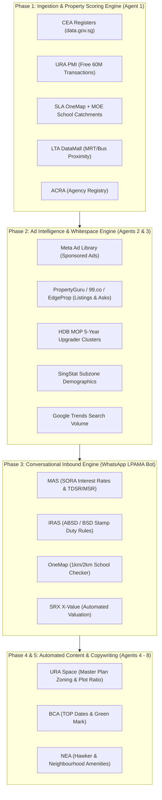

# Singapore Real Estate Data Sources & Platform Intelligence Reference (v2)

This document provides a comprehensive mapping of Singapore Government / Statutory Board portals and Private / Commercial real estate platforms, detailing how each source integrates into the **End-to-End Real Estate Lead-Generation & Intelligence Multi-Agent System**.

---

## 1. Government & Statutory Board Sources

### A. Urban Planning, Master Plan & Transaction Registries

#### 1. **URA Property Market Information (PMI)**
* **URL**: [URA Property Market Information](https://eservice.ura.gov.sg/property-market-information/pmiResidentialTransactionSearch)
* **Access**: Free public e-Service.
* **Data Types**: Official private residential property transactions with caveats lodged or Options to Purchase (OTP) issued within the last 60 months (price, PSF, project, unit level, contract date).
* **Multi-Agent Use Case**: **Agent 1 & 2** — Free, authoritative baseline dataset for private residential pricing and recent transaction momentum without requiring a subscription.

#### 2. **URA REALIS (Real Estate Information System)**
* **URL**: [URA REALIS](https://www.ura.gov.sg/Corporate/Property/Property-Data/REALIS)
* **Access**: Subscription-based.
* **Data Types**: Granular historical private residential and commercial transaction data, developer sales (launched vs. unsold units), leasing contracts, median rentals, vacancy rates, and future pipeline supply.
* **Multi-Agent Use Case**: **Agent 2 & 3 (Whitespace Analysis)** — Identifies oversupplied/undersupplied micro-markets and developer inventory overhang.

#### 3. **URA Space (Master Plan GIS Portal)**
* **URL**: [URA Space](https://www.ura.gov.sg/maps/)
* **Access**: Free public portal / GIS layers.
* **Data Types**: Master Plan 2019/2025 zoning, Gross Plot Ratio (GPR), allowable building heights, special control areas, and land use designations.
* **Multi-Agent Use Case**: **Agent 1 & 4** — Enriches project profiles with future redevelopment potential, en-bloc feasibility, and urban transformation roadmaps.

---

### B. Land Administration, Geospatial & Transport Infrastructure

#### 4. **SLA OneMap**
* **URL**: [OneMap Singapore](https://www.onemap.gov.sg/) / [OneMap API Docs](https://www.onemap.gov.sg/docs/)
* **Access**: Free Developer API / Map Portal.
* **Data Types**: High-precision geocoding, reverse geocoding, postal code database, Singapore planning boundary polygons, and amenity locations.
* **Multi-Agent Use Case**: **Agent 1 & 3** — Foundational spatial indexing layer for calculating walking distances, planning area classifications, and coordinates.

#### 5. **SLA INLIS (Integrated Land Information Service) & SPIO**
* **URL**: [SLA INLIS](https://www.inlis.gov.sg/) / [SLA SPIO](https://www.sla.gov.sg/spio)
* **Access**: Pay-per-search / Public search.
* **Data Types**: Land title searches, lot boundaries, strata title records, encumbrances, and state property leasing information.
* **Multi-Agent Use Case**: **High-Net-Worth Lead Due Diligence** — Verifying land tenure (Freehold vs. 99-year leasehold), strata land titles, and GCB (Good Class Bungalow) lot parameters.

#### 6. **LTA DataMall**
* **URL**: [LTA DataMall](https://datamall.lta.gov.sg/)
* **Access**: Free API (with API Key).
* **Data Types**: Public bus routes and stops, operational and upcoming MRT stations/lines (TEL, CRL, JRL), traffic incidents, and ERP gantries.
* **Multi-Agent Use Case**: **Agent 1 & 3** — Computes public transit proximity scores (e.g., `< 400m to MRT Station`) for automated property scoring.

---

### C. Housing Upgrader Triggers & Demographics

#### 7. **HDB InfoWEB / HDB Resale Data**
* **URL**: [HDB Map Services](https://services2.hdb.gov.sg/webapp/BB33MAPS/) / [HDB Resale Flat Prices](https://data.gov.sg)
* **Access**: Free public data.
* **Data Types**: Town and block-level resale flat transactions, flat model classifications, remaining lease years, and BTO completion years.
* **Multi-Agent Use Case (High-Conversion Lead-Gen Trigger 🎯)**:
  * **5-Year MOP Upgrader Engine**: Identifies HDB estates reaching their 5-year Minimum Occupation Period (MOP) where owners are primed to sell and upgrade to an Executive Condominium (EC) or private property.

#### 8. **SingStat (Department of Statistics Singapore)**
* **URL**: [SingStat Table Builder](https://tablebuilder.singstat.gov.sg/)
* **Access**: Free API / Datasets.
* **Data Types**: Subzone-level resident population, age demographic distribution, household monthly income brackets, and homeownership ratios.
* **Multi-Agent Use Case**: **Agent 2 & 5** — Matches subzone wealth profiles (e.g., Bukit Timah, Tanjong Rhu) with targeted ad campaigns and luxury real estate positioning.

---

### D. Financial, Tax, School & Environmental Due Diligence

#### 9. **IRAS (Inland Revenue Authority of Singapore)**
* **URL**: [IRAS Stamp Duty Portal](https://www.iras.gov.sg/)
* **Data Types**: Buyer's Stamp Duty (BSD), Additional Buyer's Stamp Duty (ABSD), Seller's Stamp Duty (SSD), and Annual Property Values (AV).
* **Multi-Agent Use Case**: **Agent 3 (WhatsApp LPAMA Bot)** — Calculates precise net-cash requirements based on buyer citizenship profile (e.g., 1st property citizen 0% ABSD vs. 2nd property 20% ABSD vs. foreigner 60% ABSD).

#### 10. **MAS (Monetary Authority of Singapore)**
* **URL**: [MAS Statistics](https://eservices.mas.gov.sg/statistics/)
* **Data Types**: SORA (Singapore Overnight Rate Average) 1M/3M/6M compounded rates, TDSR (55% max), MSR (30% max), and LTV limits.
* **Multi-Agent Use Case**: **Agent 3 (Financial Qualification)** — Real-time mortgage stress testing and loan affordability calculations for inbound buyer leads.

#### 11. **MOE (Ministry of Education)**
* **URL**: [MOE Primary One Registration](https://www.moe.gov.sg/primary/p1-registration)
* **Data Types**: Definitive Primary 1 school directory, location coordinates, and historical balloting oversubscription rates.
* **Multi-Agent Use Case**: **Agent 1 & 3** — Strict 1km / 2km school catchment radius calculation (Phase 2C priority verification).

#### 12. **BCA (Building and Construction Authority)**
* **URL**: [BCA Directory](https://www.bca.gov.sg/)
* **Data Types**: Temporary Occupation Permit (TOP) issuance dates, Green Mark sustainability ratings, and construction cost indices.
* **Multi-Agent Use Case**: **Agent 4 & 5** — Alerts leads when uncompleted projects near TOP handover and highlights energy-efficient Green Mark developments.

#### 13. **ACRA (Accounting and Corporate Regulatory Authority)**
* **URL**: [ACRA BizFile](https://www.bizfile.gov.sg/)
* **Data Types**: Corporate registry, agency company status, developer joint-venture entities, and director disclosures.
* **Multi-Agent Use Case**: **Agent 1** — Validates agency corporate licensing and developer corporate structures.

#### 14. **NEA (National Environment Agency)**
* **URL**: [NEA Portal](https://data.gov.sg) / [NEA Website](https://www.nea.gov.sg/)
* **Data Types**: Flood-prone/drainage areas, hawker centre locations, and environmental noise maps.
* **Multi-Agent Use Case**: **Agent 4 & 5** — Neighbourhood living guide content generation.

---

## 2. Private & Commercial Portals (Listing & Market Intelligence)

| Portal | Core Intelligence Data | Multi-Agent Integration Value |
|---|---|---|
| **[PropertyGuru](https://www.propertyguru.com.sg/)** | Live asking prices, active listings, agent directory, and days-on-market metrics. | **Agent 2 (Market Supply)**: Analyzes asking price vs. transacted price variance to detect seller negotiation room. |
| **[99.co](https://www.99.co/singapore)** | Rental listings, price trend heatmaps, and neighbourhood reviews. | **Agent 2 & 4**: Neighbourhood lifestyle summaries and micro-district price trends. |
| **[EdgeProp Singapore](https://www.edgeprop.sg/)** | Project analytics, new launch tracking, and EdgeProp Fair Value / X-Value tools. | **Agent 2 (Whitespace Engine)**: Tracks uncompleted new launch take-up rates and historical launch PSF trends. |
| **[SRX Property (99 Group)](https://www.srx.com.sg/)** | SRX X-Value algorithmic valuation, flash rental indices, and historical transactions. | **Agent 3 (Valuation Assistant)**: Automated preliminary valuation benchmarks for seller leads. |
| **[Meta Ad Library](https://www.facebook.com/ads/library/)** | Active Facebook and Instagram sponsored ad creatives run by property agents. | **Phase 2 (Agent 2 Core)**: Scrapes agent ad copy, targeting angles, and detects underserved new launch campaigns. |
| **[Google Trends](https://trends.google.com/)** | Search intent and interest index for Singapore property keywords. | **Agent 2 (Demand Forecasting)**: Detects consumer search spikes for upcoming preview launches. |

---

## 3. End-to-End Multi-Agent Architecture Mapping

---

## 4. Summary Matrix: Technical Ingestion Strategy

| Domain | Platform | Data Format | Auth / Access | Multi-Agent Phase |
|---|---|---|---|---|
| **Agent Registry** | data.gov.sg (CEA) | REST / JSON | Free Open Data | Phase 1 (Agent 1) |
| **Private Transactions** | URA PMI | REST / CSV | Free e-Service | Phase 1 & 2 |
| **Zoning & Master Plan** | URA Space | GIS / GeoJSON | Free Public Portal | Phase 1 & 4 |
| **Geospatial & Address** | SLA OneMap | REST API | Free API Token | Phase 1 & 3 |
| **School Boundaries** | MOE School Directory | JSON / CSV | Free Open Data | Phase 1 & 3 |
| **MOP Upgraders** | HDB Services | REST / Scraper | Free Open Data | Phase 2 (Lead Trigger) |
| **Transport Scoring** | LTA DataMall | REST API | Free API Key | Phase 1 (Scoring) |
| **Stamp Duty (ABSD/BSD)** | IRAS | REST / Ruleset | Deterministic Logic | Phase 3 (LPAMA Bot) |
| **Mortgage Rules (SORA)** | MAS Statistics | REST / API | Free Open Data | Phase 3 (LPAMA Bot) |
| **Ad Intelligence** | Meta Ad Library | Graph API | Meta Dev App | Phase 2 (Agent 2) |
| **Listings & Asking Prices**| Property Portals | Scraper / API | Rate-limited / Headless | Phase 2 (Agent 2 & 3) |
